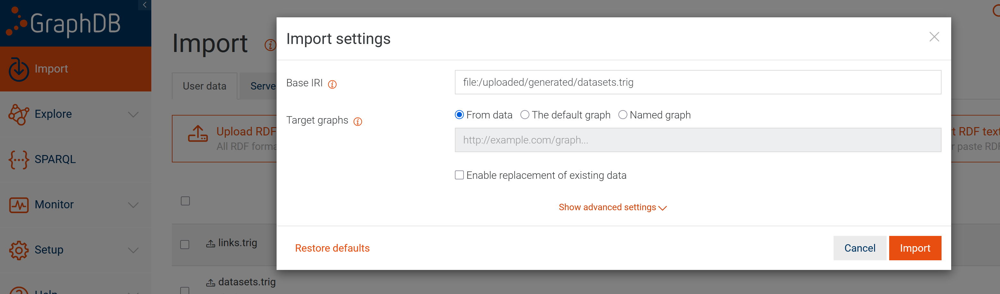
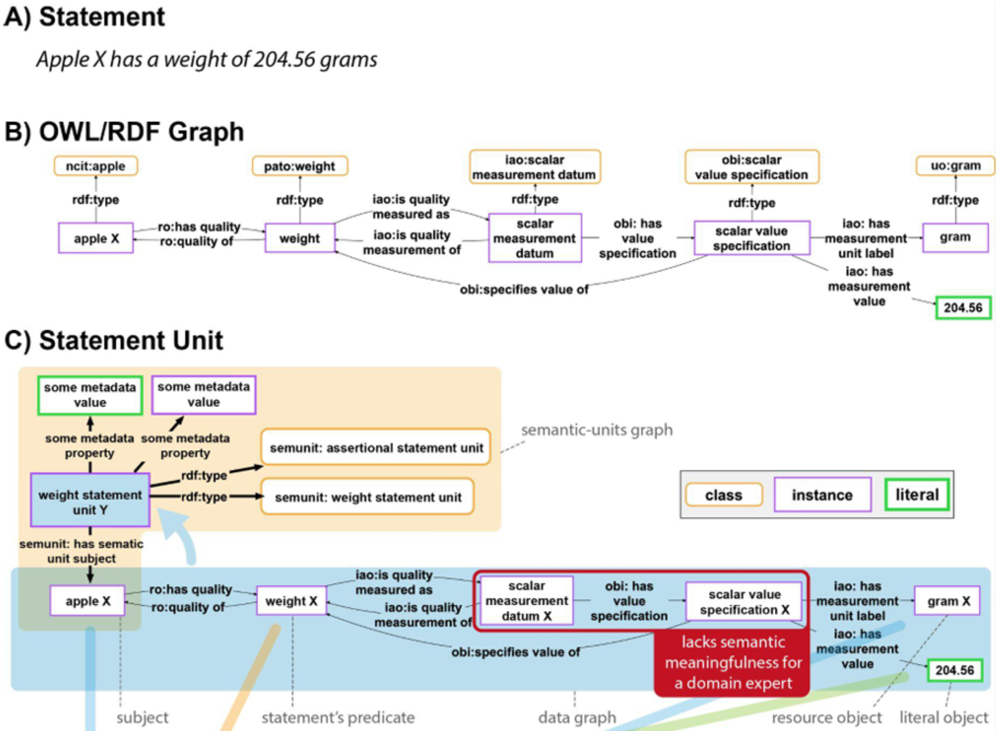
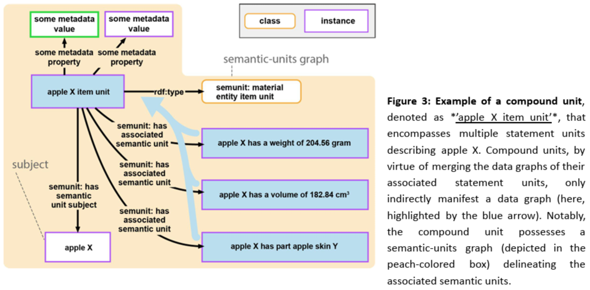
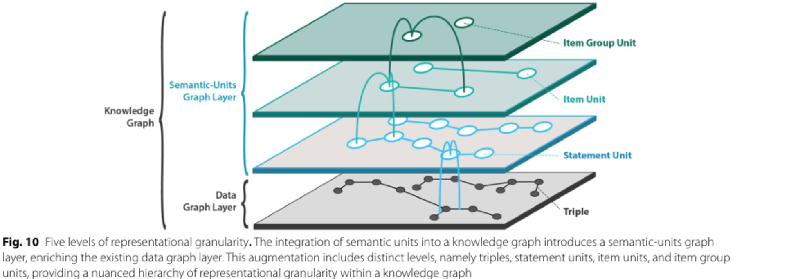

# Semantic Units Knowledge Graph for Publication and Dataset Metadata of the Biodiversity Exploratories

[](./LICENSE)


## Introduction
This repository contains files for the Knowledge Graph (KG) developed for the [Biodiversity Exploratories (BE)](https://www.biodiversity-exploratories.de/en/), that consists of publication and dataset metadata of research endeavors related to the BE.

Crucially, this KG presents the first RDF/OWL-based implementation of the [Semantic Units (SU) framework](https://doi.org/10.1186/s13326-024-00310-5).

The KG integrates BE metadata up to July 2025:
- **Publication metadata** (e.g., titles, abstracts, creators, identifiers, links, domain keywords) from 1,179 Publications
- **Dataset metadata** (e.g., titles, abstracts/descriptions, contacts, identifiers, links, domain keywords) from 1,394 Datasets
- Provenance-friendly RDF exports that can be loaded into common triple stores
- The graph consists of 502,179 triples (quads) and 71,041 Semantic Units that contain 137,096 triples total.

## Quickstart
To access the knowledge graph, first download the three zipped .trig files [here](https://github.com/fusion-jena/KG-for-Biodiversity-Exploratories-Metadata/blob/main/KG_RDF/ESWC_BE_KG.zip) and then upload them to the triple store of your choice (make sure that it supports named graphs and the TriG format, we use [Ontotext GraphDB](https://www.ontotext.com/products/graphdb/)). In the import settings, select "Import into the graph(s) specified by the data source" (see image below).



### Example SPARQL Queries
**Example 1: Return all triples contained in a given Semantic Unit:**
```sparql
SELECT ?s ?p ?o WHERE {
GRAPH <http://example.com/base/semunit/creatorStatementUnit/Publication_31436> { 
        ?s ?p ?o 
    }
}
```

**Example 2: Who authored the publication P? and were they first or co-author?**
```sparql
PREFIX rdfs: <http://www.w3.org/2000/01/rdf-schema#>
PREFIX semunit:  <http://example.com/base/semanticunits/>
PREFIX ro:       <https://www.ebi.ac.uk/ols4/ontologies/ro>

SELECT ?person ?label ?role WHERE {
	<http://example.com/base/semunit/authorsAndRolesCompoundUnit/Publication_31709>
	semunit:hasAssociatedSemanticUnit* ?su .
	GRAPH ?su { 
        ?role ro:roleOf ?person . 
    }
	?person rdfs:label ?label .
}
LIMIT 100
```

**Example 3: List all publications that belong to the infrastructure Instrumentation/Remote sensing that investigate pollination of plants on grassland plots. What are the datasets they reference and what projects do those belong to?**
```sparql
PREFIX iao:      <http://purl.obolibrary.org/obo/iao.owl>
PREFIX obi:      <http://purl.obolibrary.org/obo/OBI/>
PREFIX dcterms:  <http://purl.org/dc/terms/>
PREFIX ex:       <http://example.com/base/>
PREFIX ro:       <https://www.ebi.ac.uk/ols4/ontologies/ro>
PREFIX envo:     <http://purl.obolibrary.org/obo/ENVO_>
PREFIX rdfs:     <http://www.w3.org/2000/01/rdf-schema#>
PREFIX semunit:  <http://example.com/base/semanticunits/>

SELECT * WHERE {
  ?compound a semunit:InfrastructureProcessAndServiceEnvironmentPublicationLinkProjectsCompoundUnit ;
            ex:semanticUnitSubject ?publication .
  ?publication obi:hasPart ?titleEntity .
  ?titleEntity a iao:documentTitle ;
               dcterms:description ?title .
  ?compound semunit:hasAssociatedSemanticUnit* ?suSource .
  GRAPH ?suSource {
    ?plotcollection dcterms:source ?publication .
  }
  ?compound semunit:hasAssociatedSemanticUnit* ?suPlotPart .
  GRAPH ?suPlotPart {
    ?plots obi:partOf ?plotcollection .
  }
  ?compound semunit:hasAssociatedSemanticUnit* ?suLoc .
  GRAPH ?suLoc {
    ?plots ro:locatedIn ?env .
  }
  ?compound semunit:hasAssociatedSemanticUnit* ?suHasPart .
  GRAPH ?suHasPart {
    ?process ro:hasParticipant ?plots .
  }
  ?publication obi:partOf <http://example.com/base/BE_Infrastructure_Instrumentation_RemoteSensing> .
  ?env a envo:grasslandBiome .
  ?plots obi:hasPart <http://www.gbif.org/species/6> .
  ?process a <http://vocabs.lter-europe.net/EnvThes/21417> .
  OPTIONAL {
    ?compound semunit:hasAssociatedSemanticUnit* ?suTo .
    GRAPH ?suTo {
      ?projectto obi:hasSpecifiedOutput ?datasetto .
    }
    ?publication ?linkpropto ?datasetto .
    ?projectto rdfs:label ?labelprojectto .
  }
  OPTIONAL {
    ?compound semunit:hasAssociatedSemanticUnit* ?suFrom .
    GRAPH ?suFrom {
      ?projectfrom obi:hasSpecifiedOutput ?datasetfrom .
    }
    ?datasetfrom ?linkpropfrom ?publication .
    ?projectfrom rdfs:label ?labelprojectfrom .
  }
}
LIMIT 100
```


## Repository Contents
This repository contains artefacts from all steps of the KG construction workflow from raw data to materialized triples:
- **(1)** [./Code/BExIS/BEXIS_API.ipynb](https://github.com/fusion-jena/KG-for-Biodiversity-Exploratories-Metadata/blob/main/Code/BExIS/BEXIS_API.ipynb) contains code to download and transform metadata from BExIS. This results in three .csv files (one for publications, datasets, and the links between them) that are processed further in [Ontotext Refine](https://www.ontotext.com/products/ontotext-refine/).
- **(2)** [./OntotextRefineProjects/](https://github.com/fusion-jena/KG-for-Biodiversity-Exploratories-Metadata/tree/main/OntotextRefineProjects) holds three project exports from Ontotext Refine in .tar.gz format. Using these project files, it is possible to trace every single data processing step from the .csv input from step (1) to the processed data that is uploaded to a PostgreSQL database.
- **(3)** [./OntotextRefineProjects/SQLExports/](https://github.com/fusion-jena/KG-for-Biodiversity-Exploratories-Metadata/tree/main/OntotextRefineProjects/SQLExports) contains the SQL exports mentioned above.
- **(4)** [./MappingsAndOutputs/](https://github.com/fusion-jena/KG-for-Biodiversity-Exploratories-Metadata/tree/main/MappingsAndOutputs) contains the R2RML mappings needed to transform the database entries to materialized RDF data in .trig format. Again, there are three mapping files, for publications, datasets, and links.
- **(5)** [./MappingsAndOutputs/outputs/](https://github.com/fusion-jena/KG-for-Biodiversity-Exploratories-Metadata/tree/main/MappingsAndOutputs/outputs) contains the KG as materialized RDF data in three .trig files.
- **(6)** [./Miro Board/MA.rtb](https://github.com/fusion-jena/KG-for-Biodiversity-Exploratories-Metadata/blob/main/Miro%20Board/MA.rtb) A [Miro](https://miro.com/) board was used for KG schema modeling, and we provide an export of that board for users interested in exploring the KG's schema in detail.
- **(7)** [./Code/](https://github.com/fusion-jena/KG-for-Biodiversity-Exploratories-Metadata/tree/main/Code) This folder contains additional LLM applications on the graph, see [here](https://doi.org/10.22032/dbt.67767) for more details.
- **(8)** [./GenAI/ConversationLinks.txt](https://github.com/fusion-jena/KG-for-Biodiversity-Exploratories-Metadata/blob/main/GenAI/ConversationLinks.txt) is a text file that lists links to GPT-5 Thinking chat logs that were helpful in creating this project.
- **(9)** [./KG_RDF/](https://github.com/fusion-jena/KG-for-Biodiversity-Exploratories-Metadata/blob/main/KG_RDF) contains the final KG in a [.zip folder](https://github.com/fusion-jena/KG-for-Biodiversity-Exploratories-Metadata/blob/main/KG_RDF/ESWC_BE_KG.zip).

## Semantic Units
The Semantic Units (SU) framework propoposes the formalized usage of named subgraphs in KGs to better present semantically meaningful information to domain experts. Two core building blocks are used: **Statement** and **Compound units**. Different types of SUs are used to introduce layers of representational granularity to a KG, aiming to enhance usability for users.

(Note: We only give a small introduction to the framework here, and refer to papers that contain more detailed information, for example the original [Semantic Units paper](https://doi.org/10.1186/s13326-024-00310-5) and the [CLEAR Principles paper](https://doi.org/10.1186/s13326-025-00340-7))

### **Statement Units** (adapted from https://arxiv.org/abs/2407.10720)

"A statement unit captures the smallest unit of propositional meaning in a knowledge graph. Each triple in the graph belongs to exactly one statement unit, forming a mathematical partition of the overall graph. The data graph layer of a knowledge graph can thus be viewed as the sum of all its statement unit data graphs. Every statement unit possesses a subject resource and one or more object resources or literals. The number of RDF triples in a statement unit and with it the number of object resources or literals varies depending on the arity of the underlying predicate or verb (Fig. 1C)." (quoted from https://arxiv.org/abs/2407.10720, p.7)

### **Compound Units** (adapted from https://arxiv.org/abs/2407.10720)

"A compound unit serves as a higher-level organizational resource that groups together a semantically meaningful collection of semantic units (either statement or compound units). Each compound unit is represented by its own GUPRI and instantiates a corresponding compound unit class (Fig. 3). Unlike statement units, compound units do not contain a data graph; instead,  their meaning is derived entirely from the units they aggregate. Thus, they contribute exclusively to the semantic-units graph layer of a knowledge graph, and not to its data graph layer." (quoted from https://arxiv.org/abs/2407.10720, p.9)

### **Representational Granularity** (adapted from https://doi.org/10.1186/s13326-024-00310-5)

"Two basic categories of semantic units—statement units and compound units—are introduced, supplementing the well-established triples and the overall graph in FAIR knowledge graphs. These units offer a structure that organizes a knowledge graph into five levels of representational granularity, from individual triples to the graph as a whole. In further refinement, additional subcategories of semantic units are proposed for enhanced graph organization. The incorporation of Unique Persistent and Resolvable Identifiers (UPRIs) for each semantic unit enables their efficient referencing within triples, facilitating an efficient way of making statements about statements. The introduction of semantic units adds further layers of triples to the well-established RDF and OWL layer for knowledge graphs (Fig. 1). This augmentation aims to enhance the usability of knowledge graphs for both domain-experts and developers." (quoted from https://doi.org/10.1186/s13326-024-00310-5, p.3)

## How to Cite
The knowledge graph has a persistent DOI: https://doi.org/10.71615/bexis.32235

If you use this repository in academic work, please cite: 

```bibtex
@article{https://doi.org/10.22032/dbt.67767,
  doi = {10.22032/DBT.67767},
  url = {https://www.db-thueringen.de/receive/dbt_mods_00067767},
  author = {Al Mustafa, Tarek},
  keywords = {Wissensgraph, Biodiversität, Interoperabilität, 004},
  language = {en},
  title = {From metadata to meaning: a semantic units knowledge graph for the biodiversity exploratories},
  publisher = {Friedrich-Schiller-Universität Jena},
  year = {2025}, 
  copyright = {Creative Commons Attribution 4.0 International}
}
```
